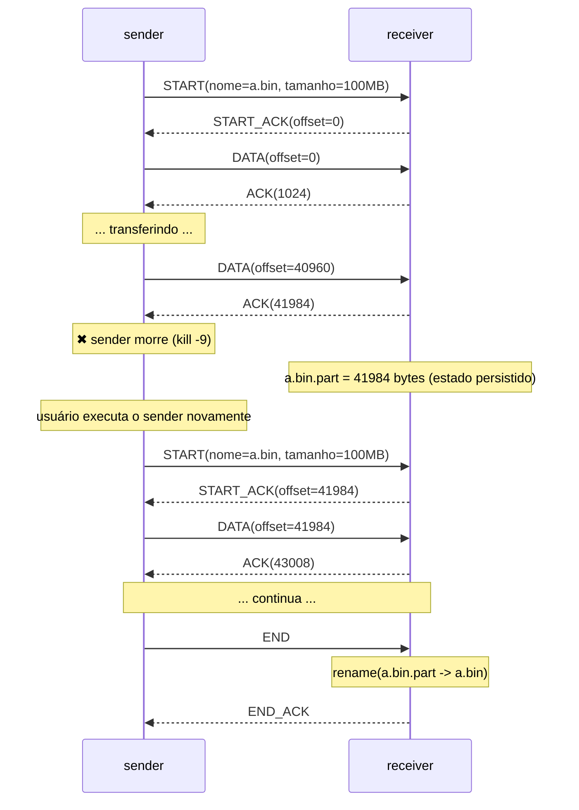
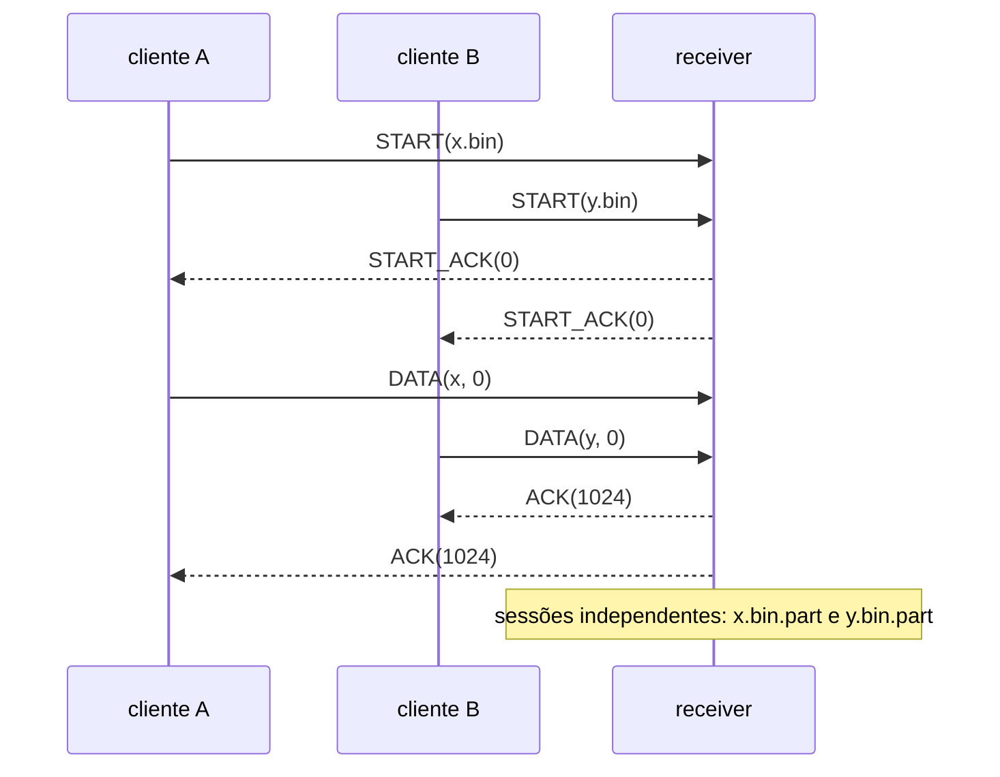

# INE5418 – Relatório do T1: Transferência de Arquivos Distribuída

**Grupo 1:** NomeA, NomeB, NomeC   <!-- TODO -->

> Este arquivo é um rascunho. O relatório entregue deve ser um **.pdf**
> (ex.: `pandoc relatorio.md -o relatorio.pdf`, ou escrever no Google Docs/LaTeX e exportar).
> Os diagramas abaixo estão em Mermaid (renderizam no GitHub/VS Code); exporte como imagem para o PDF.

## 1. Retransmissão e garantia de entrega

**Como a implementação lida com retransmissão e garantia de entrega?**

TODO: explicar
- Stop and Wait: um DATA em voo; só avança com ACK correspondente
- Timeout (300 ms) e limite de tentativas (20)
- Perda do DATA vs perda do ACK
- Idempotência no receiver: `offset < esperado` → não grava, só reenvia ACK
- CRC32 descarta pacotes corrompidos (tratados como perdidos)
- Gravação em `.part` + `rename()` atômico ao fim

### Caso de uso: falha do processo cliente

TODO: ajustar números reais após os testes.

## 2. Clientes concorrentes

**Como a implementação lida com clientes concorrentes?**

TODO: explicar
- Um socket UDP + `poll` + tabela de sessões por (ip, porta)
- Cada sessão tem seu próprio `.part`, offset e fd
- Mesmo nome ao mesmo tempo → `ERR_BUSY`
- Timeout de sessão inativa (o `.part` é mantido)

### Caso de uso

## 3. E se pudéssemos usar TCP?

TODO: discutir o que simplificaria
- Entrega confiável, ordenada e sem duplicatas pelo próprio protocolo
- Sem timeout/retransmissão/numeração de sequência manual
- Controle de fluxo e de congestionamento prontos
- Throughput bem maior (janela deslizante vs. Stop and Wait)
- O que ainda precisaria ser feito: retomada (offset), protocolo de aplicação, concorrência

## Referências
- Stop-and-wait ARQ — Wikipedia / GeeksforGeeks (links do enunciado)
- Material da disciplina: INE5418_05_sockets, INE5418_09_multiplex_sockets
